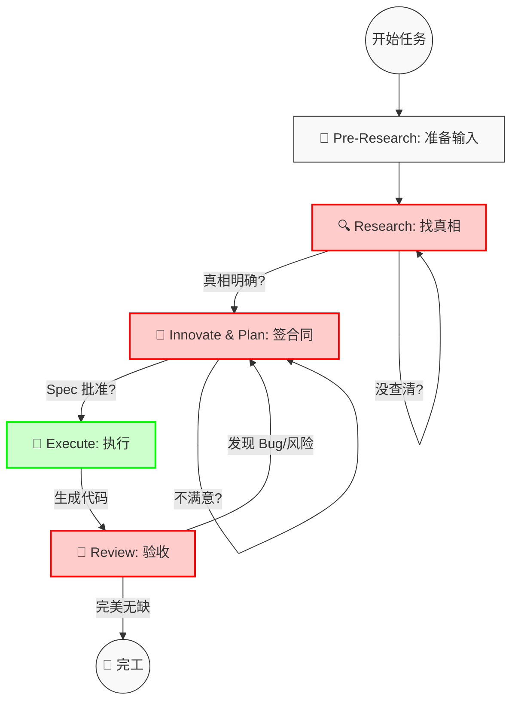

# 如何快速从零开始落地大模型编程 -- 手把手教程

**阅读路径（SDD 三部曲）**  

* 觉醒篇：[《从传统编程转向大模型编程》](./从传统编程转向大模型编程.md)
* 内功篇：[《AI 原生研发范式：从“代码中心”到“文档驱动”的演进》](./AI 原生研发范式：从“代码中心”到“文档驱动”的演进.md)
* 本文：招式篇，专注落地实操（可直接开用，按需回看前两篇）

## 🛑 写在前面：核心逻辑与导读

本教程主旨是**快速建立稳定的大模型编程流程**；SDD 是我验证最稳的一条路径，但方法论可迁移和替换。

1. **30 秒上手（最小闭环）**SDD 只有一句话：**让 AI 围绕“文档清单”干活。**你先做三件事：**写清单 → 执行 → 验收**。先跑通一遍，流程感就有了。

2. **为什么需要稳定方法（本文以 SDD 为主）**：

    * **痛点 1：上下文腐烂（Context Decay）**对话越长 AI 越容易忘事、幻觉、偏题，开启新对话后恢复上下文非常痛苦。**SDD 解法**：用 Spec 文档作为外部状态锁，强制回正。

    * **痛点 2：审查瘫痪（Review Paralysis）**AI 一分钟生成千行代码，人根本看不过来，不敢合并。**SDD 解法**：只审查 Spec 与关键逻辑，把“黑盒猜谜”变成“白盒验收”。

    * **痛点 3：维护断层（Maintenance Gap）**全是 AI 生成的陌生代码，两周后没人敢动。**SDD 解法**：代码是消耗品，文档才是资产；修 Bug 先修文档。

3. **主线方案：Pre-Research + RIPER（全程遵循 SDD）**

    * **Pre-Research**：`create_codemap` / `build_context_bundle` 做输入准备；`sdd_bootstrap` 作为 RIPER 启动命令，进入 Research 第一步。

    * **RIPER**：Research / Innovate / Plan / Execute / Review。

    * **SDD**：全程维护 Spec（No Spec, No Code；发现偏差先修 Spec 再修代码）。

    * **适用场景**：复杂需求、长周期开发；小任务先跑“最小闭环”。

> **🎓 术语小抄**：
> **SDD**：文档驱动开发，使用文档来主导代码开发。
>
> **Spec**：那份“文档”，包含需求、约束、验收标准。
>
> **Pre-Research**：RIPER 前的输入准备层（CodeMap / Context）。
>
> **sdd_bootstrap**：RIPER 启动命令（收口前置信息并进入 Research 第一步）。
>
> **RIPER**：完整工作流（Research / Innovate / Plan / Execute / Review）。

**🎯 适合谁 / 怎么读 / 你会得到什么**

* **适合谁**：从零开始或还没有稳定 AI 编程流程的人。

* **怎么读**：按章节实战跟做即可。

* **得到什么**：一套可复用的协作流程 + 真实案例全流程复盘 + 可沉淀的 Spec 模板。

**🏆 毕业标准** 多用几次、理解理念后，你就不再需要这套教程，而是自然长出自己的方法。

---
> 很多 AI 教程只展示“一发入魂”的 Prompt，那是在骗你。真实的软件开发，充满了**模糊的需求、隐藏的 Bug、架构的权衡、以及对 AI 的反复纠偏**。今天，我将公开一个高难度需求（20 多轮对话）的全过程。我**没有删减**那些“反复论证”的过程，因为那才是 SDD 的精髓。无论你用的是前沿通用模型，还是受控环境中的合规模型，请严格遵循这套 **RIPER 五步法**。
>
> 💡 完整理论体系可阅读：[《AI 原生研发范式：从“代码中心”到“文档驱动”的演进》](./AI 原生研发范式：从“代码中心”到“文档驱动”的演进.md)

---

## 🧭 第一章：起飞前的准备 (工具与心法)

**1. 核心心法 (The Sun Theory)**

* **Spec 文档是“太阳”**：所有的代码、讨论、修改都是围绕太阳转的“行星”。

* **你不是工兵，是守门人**：你的任务是通过对话不断 Review 和维护 Spec 文档，死死按住 AI，不让它脱离轨道。

**2. 必做设置**

* **关闭 YOLO / automatically / 全自动模式**：绝对禁止 AI “先斩后奏”。

* **开启 Agent 模式**：让 AI 可以读写文件。

* **注入灵魂**：把 `SDD-RIPER-ONE` 协议发给模型。[《SDD-RIPER-ONE》](../protocols/SDD-RIPER-ONE.md)

* **优先走仓库内文档安装路径**：
  * 方式 A（Skill）：直接阅读并启用 [sdd-riper-one](../skills/sdd-riper-one/SKILL.md)
  * 方式 B（协议）：直接使用 [SDD-RIPER-ONE](../protocols/SDD-RIPER-ONE.md) 作为启动协议
  * 推荐团队默认“Skill 必装 + 本地模板可选增强”。

---

## 🗺️ 第二章：战役总览 —— Pre-Research + RIPER 阶段论 (全量复盘)

> 先对齐口径：`Pre-Research -> RIPER`，全程按 SDD 维护 Spec。RIPER 从 Research 开始，`sdd_bootstrap` 负责启动并进入第一步。



* **Pre-Research**：准备输入（CodeMap / Context），并通过 `sdd_bootstrap` 启动 RIPER。

* **R (Research)**：找真相（查清代码现状和确认需求，绝不瞎猜）。

* **I & P (Innovate & Plan)**：签合同（反复拉扯，定死 Spec 文档）。

* **E (Execute)**：落地（无脑执行，生成代码）。

* **R (Review)**：反向同步（发现 Bug 改文档 改代码）。

**本案例的对话轮次映射（真实 case 导航）：**

| 阶段 | 对话轮次 | 关键产物 |
| --- | --- | --- |
| Pre-Research | 0（启动） | CodeMap/Context 收口，sdd_bootstrap 启动 Research |
| Research | 1-3 | 入口统一前提、管控链路核查 |
| Innovate | 4-7 | 方案对比与最终取舍 |
| Plan | 8-11 | 约束清单 + Plan Approved |
| Execute | 12-13（含后续编译修正） | 代码落地 + 修错 |
| Review | 14-19 | 风险清单 + 反向同步 + 补扫 |

这是本教程的核心。我们将结合 **理论 (Why/How)** 与 **实战 (Real Case)**，带你走完 20 轮对话。建议同时准备一份**完全脱敏的本地 Spec 文档**对照阅读。

---

### 🧩 Step 0: Pre-Research（输入准备与启动）

#### 📖 为什么先做 Step 0？

* **价值 1：降低幻觉与跑偏**。先把代码索引和需求语料收口，Research 阶段不再“空口猜”。

* **价值 2：减少无效 token 消耗**。把可复用上下文沉淀成 CodeMap / Context Bundle，后续轮次不必反复全仓扫描。

* **价值 3：加速 Research 收敛**。`sdd_bootstrap` 直接把输入转成首版 Spec，团队可以马上进入“审查和修正”模式。

* **价值 4：形成长期资产**。Pre-Research 产物可复用到下一次需求，老项目收益尤其明显。

#### 🧭 三步怎么用？

1. `create_codemap`：代码侧输入准备  
   * 指令：create_codemap: mode=project, scope=<项目名>, goal=输出项目总图与主流程
   * 作用：生成功能级/项目级代码索引，锁定入口、链路、依赖、风险。  
   * 是否必须：**非必须**；中大型任务强烈建议先做。  

2. `build_context_bundle`：需求侧输入准备  
   * 指令：build_context_bundle: <需求资料目录路径>
   * 作用：把文档/图片/讨论记录提炼成可直接研究的上下文包。  
   * 是否必须：**非必须**；需求分散、资料复杂时强烈建议先做。  

3. `sdd_bootstrap`：RIPER 启动命令  
   * 指令：sdd_bootstrap: task=<任务名>, goal=<目标>, requirement=<需求文档或描述>
   * 作用：收口输入并进入 Research 第一步，产出首版 Spec。  
   * 是否必须：**建议必须**（常规流）；仅在极小改动的 FAST 通道可跳过。  

#### 📦 Step 0 推荐输入（常规流）

* **详细需求**：任务目标、边界、验收口径。  
* **Code Map 索引**：入口、核心链路、依赖、风险。  
* **Context 语料**：PRD / 设计图 / 历史讨论 / 约束文档。  

> **推荐的工程目录结构（Best Practice）：**
>
> 为了实现上下文的高效管理，建议采用以下标准目录分层：
> `**apis/**`：接口契约层。存放与前端/客户端对齐的 API 接口定义文档。
> `**codemap/**`：代码拓扑层。维护“业务功能”与“物理代码（类/函数）”的映射关系索引。
> `**context/**`：原始语料层。归档需求文档 (PRD)、UI 设计图、关键讨论记录等复杂背景信息。
> `**specs/**`：核心协议层。存放经过 SDD 流程产出的标准 Spec 文档。

**Step 0 / Research 启动 SOP：** 先通过 `sdd_bootstrap` 启动 RIPER 并进入 Research 第一步；标准输入为**详细需求**、**Code Map 索引**、**Context 语料**。若输入不完整，先落首版 Spec 并显式标注缺口，再在 Research 中迭代补齐。然后通过**人工审查 (Human Review)** 与多轮对话修正，完成对意图的最终锁定。

#### ✅ Step 0 完成标准（进入 Step 1 的门槛）

* 至少已有一份首版 Spec（哪怕是最小版本）。  
* 缺失信息已在 Spec 中显式标注（而不是藏在对话里）。  
* 下一轮可以直接围绕 `Research` 做事实核查与边界确认。  

---

### 🔍 Step 1: Research (调研与意图锁定)

#### 📖 理论篇：这一步做什么？

* **Why (为什么做)**：**消除信息差与幻觉**。如果不让 AI 查代码，它会瞎猜，导致写出来的代码调用了不存在的接口，或者完全不符合你们的代码风格。我们需要把模糊的需求变成确定的“事实”，并把关键前提（入口、权限链路、历史逻辑）锁死，否则后续 Innovate/Plan 都是在空中搭楼。

* **How (怎么做)**：
  * **使用sdd_bootstrap** 启动 RIPER 并进入 Research 第一步，如果在step0已经启动了此命令则不需要重复启动。

  * **基于 Step 0 产物核查**：以首版 Spec + CodeMap + Context 为输入，逐条核对事实。

  * **强制查阅**：逼 AI 去读代码库，把函数名、类名、逻辑分支找出来给你看。

  * **反向复述**：让 AI 复述需求，并指出不清晰的地方。

  * **逼它提问**：要求 AI 先列出它不确定的点与必须确认的前提，再进入方案讨论。

  * **要求出处**：不接受“空口结论”，必须给出文件路径、关键调用链。

* **Done (完成标准)**：Research 已锁定“入口/链路/边界/风险”，且全部回写到 Spec（含未决项与证据出处）。

#### 📌 老项目/大项目的 Research 复利策略

老项目启动慢、上下文复杂，这是**不可避免的阵痛**。与其反复拖着痛，不如趁这个机会做一次“手术”，把高价值上下文沉淀下来。

* **一次到位的价值**：专门花 1-2 天，让大模型系统性 Research 项目，沉淀 3-5 份高价值的 Research Spec（只包含项目/功能上下文），这会成为团队的长期资产。

* **按功能切片沉淀**：给模型 1-2 个核心功能的关键文件/类，让它先梳理并沉淀一个功能 Spec；下次遇到新功能再重复一次，慢慢补齐老项目的大图谱。

* **避免“永远没有文档”**：老项目没人整理，就永远没有好文档。现在用这套方法，把“阵痛”转成“手术”，反而是造福所有人。

#### 🎮 实战篇：第 1-3 轮对话复盘（脱敏示例）

**【第 1 轮：需求启动】**

**我（输入）：**

```plaintext
我现在有一个需求：某个面向外部协作者的资源访问能力，需要补“审批授权 + 时效控制”。
现有系统已经支持“审批通过后自动授予访问权限”。
现在我想确认三件事：
1) 访问入口是否已经有统一的安全管控；
2) 审批通过后，当前链路是否真的会自动授权；
3) 如果要做时效控制，应该选“临时访问令牌”还是“授权后定时回收”？
```

**模型（输出摘要）：**

* 先确认访问是否统一经过鉴权入口，并核查实际链路。
* 先确认安全策略在哪个处理节点生效。
* 先确认审批回调链路里是否真的存在“自动授权”动作。

**模型追问/引导：**

* 外部访问是否一定走统一入口？
* 资源是否必须登录后才能访问？
* 是否存在任何绕过主入口的历史路径？

**小结**：第一轮不急着给方案，而是先把“入口与链路”锁死，避免后续讨论建立在错误前提上。

**【第 2-3 轮：补充关键前提】**

**我（输入）：**

```plaintext
1. 分享给外部协作者时，当前也走统一鉴权入口。
2. 资源必须登录后才能访问，所以入口基本可控。
3. 我担心如果做临时令牌，需要评估它到底该挂在哪个层次。
基于这些前提，你怎么评估两种时效方案？
```

**模型（输出摘要）：**

* 在“入口统一 + 必须登录”的前提下，临时令牌方案具备可行性。
* 但如果入口未来分叉，这类方案容易失效，需要把依赖前提写进 Spec。

**小结**：把关键前提写入 Spec，后续所有方案都要围绕这些前提展开。

---

### 💡 Step 2: Innovate (设计与推演)

#### 📖 理论篇：这一步做什么？

* **Why (为什么做)**：**避免局部最优**。AI 往往会给出“最平庸”的方案。我们需要通过发散思维，找到更优雅、更安全的架构；真正的价值在于**人类的取舍与拍板**。

* **How (怎么做)**：

  * **审讯游戏**：让 AI 列出 2-3 个方案的 Pros/Cons（优缺点）。

  * **挑战它**：比如_“如果用户绕过了入口怎么办？”_

  * **决策**：作为人类指挥官，你根据分析拍板。

  * **自我质疑**：逼 AI 说出“它最推荐方案的最大风险”，避免顺从性幻觉。

  * **明确前提**：让 AI 复述“方案成立的前提”，否则不进入 Plan。

* **Done (完成标准)**：产出 `Design Spec`，方案经过了你的 Sign-off。

#### 🎮 实战篇：第 4-7 轮对话复盘（对话拉扯）

**【第 4 轮：要求研究方案】**

**我（输入）：**

```plaintext
基于这些信息，研究方案。
```

**模型（输出摘要）：**

* 初步给出“临时访问令牌”与“授权后定时回收”的对比框架。
* 提醒需要确认审批链路中的实际授权触发点。

**【第 5 轮：质疑临时凭证落点】**

**我（输入）：**

```plaintext
我理解当前这个校验点更偏“授权动作管理”，
不一定是访问入口本身。
如果临时令牌不放在这里，
是不是要在多个入口都补逻辑？这样复杂度会不会上升？
请调研这一点。
```

**模型（输出摘要）：**

* 当前校验点偏授权链路，不等同于访问入口。
* 如果时效控制做在访问层，可能需要覆盖多个入口，复杂度会上升。
* 只有在系统已经存在统一入口时，临时令牌方案才会比较干净。

**【第 6 轮：再次对比两方案】**

**我（输入）：**

```plaintext
再研究一下：
临时令牌 vs 授权后再撤销授权，
这两者哪种更好？
```

**模型（输出摘要）：**

* 临时令牌：改动可能更小，但依赖入口统一。
* 授权后回收：成本更高，但安全边界更强、对入口依赖更小。
* 继续追问你到底是更看重“实现成本”，还是更看重“边界稳定”。

**【第 7 轮：最终决策】**

**我（输入）：**

```plaintext
那我觉得“授权后再回收”在这个方案里反而更好。
顶尖程序员如何评估？
```

**模型（输出摘要）：**

* 认可该选择，但提醒工程成本会落在：定时任务、幂等、失败重试、审计链路。
* 继续追问：回收周期、默认有效期、外部协作者判定规则。

**模型追问/引导（复原式）：**

* 你是否接受“入口依赖”的安全边界？

* 回收周期希望是多少？默认有效期是否固定为 24h？

* 外部协作者判定是否严格依赖“组织内/外”？

---

### 📝 Step 3: Plan (规划与契约)

#### 📖 理论篇：这一步做什么？

* **Why (为什么做)**：**文档即协议**。我们要把 Innovate 阶段“清晰的思路”变成“精确的施工图”。无脑执行的基础是 Plan 足够细，任何“模糊词”都会在 Execute 里变成偏差。

* **How (怎么做)**：

  * **原子级拆解**：列出所有涉及的文件路径、数据结构、配置项。

  * **立规矩**：在 Plan 里写死约束（如“默认 24 小时”、“向下取整”）。

  * **锁死边界**：把灰度、外部人判断、失败兜底、默认值写清楚，避免 AI 自由发挥。

  * **复述对齐**：让 AI 解释“为什么这样放置在某层”，确保不是套模板。

* **Done (完成标准)**：AI 生成 Markdown Spec 文档。哪怕换一个 AI，看着文档也能写出代码（无歧义）。

#### 🎮 实战篇：第 8-11 轮对话复盘（把约束写成 Spec）

**【第 8-10 轮：立规矩】**

**我（输入）：**

```plaintext
我的想法是这一期先按照“授权后 + 定时任务回收”做。
现有审批通过自动授权链路已经比较成熟，
现在重点是补时效控制。
我需要增加一些细节：
1) 使用定时任务收权，10 分钟或 30 分钟运行一次，检查到期授权并收回权限；
2) 外部协作者权限一次性收回所有，直接回到无权限状态，保证安全下限；
3) 默认有效期 24 小时，并且往少了算（向下取整）；
4) 这套要加灰度，并确认被授权方不在当前组织内；
5) 对多人或群授权，只对外部成员应用该逻辑；
6) 逻辑是新增外加，不影响原有内部授权链路和非灰度组织。
```

**我（补充输入）：**

```plaintext
回收权限先复用现有的“统一回收能力”。
群授权先参考现有群处理能力，不改动原有逻辑，只处理外部成员。
缓存 key 按性能优先，全部按 30 分钟刻度归桶。
默认 30 分钟，可配置化（全局默认 + 租户覆盖）。
自动授权触发条件先调研再落。
缓存型方案先做，必要时再评估落库。
灰度开关单独配。
```

**模型追问/引导（复原式）：**

* 回收是否可直接复用现有统一回收能力？
* 是否允许先用缓存型方案，后续再评估落库？
* 群授权是“展开成员记录”还是“只做回收标记”？

**模型（输出摘要）：**

* 形成“时间桶”机制与向下取整策略（30 分钟刻度）。
* 输出配置项（默认值 + 租户覆盖）。
* 明确灰度 + 外部协作者范围与不影响原逻辑的边界。
* 补充授权链路的挂载点与回收逻辑。

**【第 11 轮：批准】**

**我（输入）：**

```plaintext
可以 下一步 Plan Approved
```

**小结**：Plan 一旦通过，后续就是“按图施工”。

### 📌 Spec 关键段落摘录（节选）

> 以下摘自一个脱敏后的示例 Spec，仅保留关键段落说明“对话如何落成 Spec”。

**节选 1：本期新增目标（范围与边界）**

* 审批通过自动授权保持不变，在此基础上增加**定时任务收权**。

* 默认有效期：**24 小时（向下取整）**，仅对**灰度组织 + 外部用户**生效。

* 逻辑为**新增外加**，不影响原有内部授权逻辑。

**节选 2：缓存 Key 设计**

* `timed_access_bucket = "<namespace>:timed-access:bucket:<tenant>:<timeslot>"`
* `timed_access_index = "<namespace>:timed-access:index:<tenant>"`
* `timed_access_scan_cursor = "<namespace>:timed-access:scan-cursor:<tenant>"`

**节选 3：实施清单（节选）**

1. 新增灰度配置与缓存 key。
2. 增加“时效授权记录”模型与管理器。
3. 在审批回调中记录时效授权。
4. 新增定时任务回收到期权限。

---

### 🚀 Step 4: Execute (执行与编码)

#### 📖 理论篇：这一步做什么？

* **Why (为什么做)**：**防止跑偏**。AI 的注意力窗口有限，一次生成太多必然出错；执行必须像“按图施工”。

* **How (怎么做)**：

  * **分步指令**：按照 Plan，一步一步来。

  * **中断回溯 (Stop & Loop Back)**：如果在开发过程中，AI 发现代码逻辑走不通，**必须立刻中断**。回到 Plan 阶段重新审视设计。

  * **自检**：完成之后，要求 AI 复述“做了什么、是否对齐 Spec”，不对齐就回退。

* **Done (完成标准)**：代码文件被创建，编译通过；每一步都对齐 Spec。AI 没有任何废话，只是在做一个打字员。

#### 🎮 实战篇：第 12-13 轮对话复盘（执行与修错）

**【第 12 轮：执行开始】**

**我（指令）：**

```plaintext
继续，按 Plan 执行。
```

**模型（输出摘要）：**

* 新增灰度开关配置。
* 新增时间桶、索引和扫描游标相关缓存 key。
* 新增有效期与回收周期配置（默认 + 租户覆盖）。
* 新增“时效授权记录”模型。
* 新增“时效授权管理器”，负责记录、去重、回收和外部协作者判定。
* 在审批回调处理链路中记录时效授权。
* 新增定时回收任务，扫描并回收到期权限。

**【第 13 轮：编译错误修正】**

**我（输入）：**

```plaintext
[ERROR] ... 复用父类内部依赖时出现可见性限制
[ERROR] ... 缓存写入接口的参数签名不匹配
```

**模型（动作，最小修复）：**

* 在当前审批处理器中显式注入需要的消息组件，避免依赖父类私有成员。
* 把缓存写入改成带 TTL 的标准接口，并补齐 scan-cursor 的过期时间。

**执行节奏（复原）**：

* 你多次输入“继续”，要求模型按 Plan 逐项把所有修改做完。

* 这是为了避免模型“只做半截”，强制其逐条对齐 Plan 清单。

**小结**：执行阶段允许修错，但**涉及逻辑变更必须回到 Plan**。

---

### 👀 Step 5: Review (审查与验收)

#### 📖 理论篇：这一步做什么？

* **Why (为什么做)**：**解决“维护断层”**。如果发现 Bug 只修代码不修 Spec，Spec 就成了废纸。下一次 AI 再读 Spec，就会把你修好的 Bug 再覆盖回去！Review 的本质是“校验 Spec 与现实的一致性”。

* **How (怎么做)**：

  * **法医式审查**：把 Spec 和代码喂给 AI，寻找隐患。

  * **反向同步 (Reverse Sync)**：如果发现 Bug（比如漏扫了数据），**先改文档，再改代码**。

  * **新会话审查**：最好换模型/新会话，减少顺从性偏差。

* **Done (完成标准)**：Bug 修好了，同时 Spec 文档里也记录了这个逻辑变动；风险点被明确关闭。

#### 🎮 实战篇：第 14-20 轮对话复盘（审查与反向同步）

**【第 14 轮：Review 找茬】**

**我（输入）：**

```plaintext
review
```

**模型（风险清单）：**

1. **scan-cursor 丢失可能只扫当前桶，漏扫历史数据。**
2. 获取群成员失败导致外部成员未记录。
3. 执行回收时使用的身份权限不足，可能导致回收失败。
4. bucket 无 TTL，失败记录可能长期驻留。

**【第 15-16 轮：修正群成员逻辑】**

**我（输入）：**

```plaintext
群成员获取参考现有代码里的稳定实现，优先使用资源所有者身份拉取更稳。
```

**模型（动作，反向同步）：**

1. **先改 Spec**：新增“优先使用所有者身份拉群成员，失败时再降级到操作者身份”。
2. **再改代码**：在审批回调处理器里落地该逻辑。

**【第 18-19 轮：修正补扫逻辑（关键）】**

**我（输入）：**

```plaintext
还有什么没做的？我可以提交代码了吗？
```

**模型（提醒）：**

> scan-cursor 补扫逻辑还没落地，建议先补齐。

**我（输入）：**

```plaintext
好的，补齐。
```

**模型（动作，反向同步）：**

1. **先改 Spec**：补充“scan-cursor 缺失或落后过久时按最大有效期窗口补扫”。
2. **再改代码**：在定时回收任务中增加补扫逻辑。

**【第 20 轮：完工】**

**小结**：真正的 Review 不是“看一眼”，而是**修风险 + 反向同步 Spec**。这一步保证后续可复现。

## ⚙️ 现实落地与效率预期

从 0 启动且改动很小时，完整走一遍流程**不一定划算**。上下文对齐的时间可能超过手敲，这是成本结构的现实，不是方法失败。

* **多轮对话的意义**：把精华沉到 Spec，后续同一链路反复迭代时才会回本。

* **提效不要神话**：维护 Spec 仍要时间，x 倍提效并不现实；但可换来稳定性、可回溯与可复用。

* **Spec 是活文档**：不是无限新增，可被总结、拆分、合并；可按项目/链路/功能维度组织。

* **复杂项目的沟通成本**：在古老复杂的项目中，为了改一个小功能调研一整天，和大模型反复对话解释是常态；Spec 把复杂性与个性问题沉淀下来，避免下次new chat还需要重复这些流程。

* **降低启动成本**：给模型 1-2 个关键文件/类做锚点，让它自研上下文并沉淀 Research Spec；下次换功能再重复。

* **小改动的取舍**：只写关键前提与验收点即可，避免过度流程化。

---

## 🧪 读者自练（自选项目/公开示例）

**练习 1：只看你的对话记录，写出 Research 事实清单**

* 从前几轮对话中提炼 3-5 条“可验证事实”（入口、链路、决策点）。

* 目标是能用 5 句话讲清楚“事实是什么，证据在哪里”。

**练习 2：只看你的 Spec，反推 Plan 清单**

* 从 Spec 中提取 5-8 条“原子级实施步骤”。

* 检查是否覆盖：灰度、外部人判定、回收周期、bucket 设计、补扫策略。

**练习 3：对照你的对话记录，标注 RIPER**

* 在对话记录中，用 R/I/P/E/R 标注每轮所属阶段。

* 如果某一轮“跨阶段”，说明原因（比如发现问题需要回退）。

**练习 4：复用同一结构，要求 AI 复盘**

```plaintext
请按 RIPER 五步法复盘这个 case：
1) 先列出 Research 的事实清单与出处；
2) 给出 Innovate 的方案对比与取舍理由；
3) 抽取 Plan 的关键约束与实施清单；
4) Execute 中出现过的错误与修复；
5) Review 中的风险点与反向同步动作。
```

如果没有真实项目，可用公开项目或小功能做演练。完成以上练习后，你会真正掌握“如何指挥 AI”而不是“只会看案例”。

---

## ✅ 总结

* **对话先锁事实**：入口、链路、决策点必须先核查，再谈方案。

* **Spec 是唯一事实源**：每次补前提或改逻辑，先写 Spec 再写代码。

* **方案必须对比并标明前提**：成本、风险、边界写清楚再拍板。

* **Plan 要能施工**：文件路径、关键接口、配置与步骤全部显式化。

* **Execute 小步推进**：分步执行、最小修复、逻辑变化回到 Plan。

* **Review 反向同步**：风险清单 → 文档更新 → 代码修复，形成闭环。

* **把 AI 当实习生**：需要纠偏、需要复述、不要追求“一发入魂”。

* **阵痛转手术**：老项目启动慢是必然的，趁这次“阵痛”做系统 Research，沉淀高价值 Spec，长期收益最大。

* **小改动要权衡**：从 0 启动且改动很小时，不必硬套完整流程，抓住关键前提与验收即可。

## 🎁 附录

### 🛠️ 协议启动码 (System Prompt)

> Prompt 的正确读音是 /prɒmpt/ (英式) 或 /prɑːmpt/ (美式)，中文谐音近似“普浪特”。

[《SDD-RIPER-ONE》](../protocols/SDD-RIPER-ONE.md)

### 📋 此 case 对应的完整 Spec

建议使用你自己的完全脱敏 Spec，或在当前仓库中另行维护本地示例文件；这里不再附带外部文档链接。

### 🧠 SDD方法论

[《AI 原生研发范式：从“代码中心”到“文档驱动”的演进》](./AI 原生研发范式：从“代码中心”到“文档驱动”的演进.md)

### 🚀 SDD理念

[《从传统编程转向大模型编程》](./从传统编程转向大模型编程.md)

### 📦 git仓库地址

[SDD-RIPER: AI-Native Development Protocol](../README.md)

---

**结语**： 看到这里，你应该明白了为什么 SDD 能成事。 它不是魔法，它是**严谨的工程学**。它把一次性的“灵感爆发”，变成了一步一个脚印的“工业化生产”。 **请复制这份教程，去指挥你的 AI 吧。**
